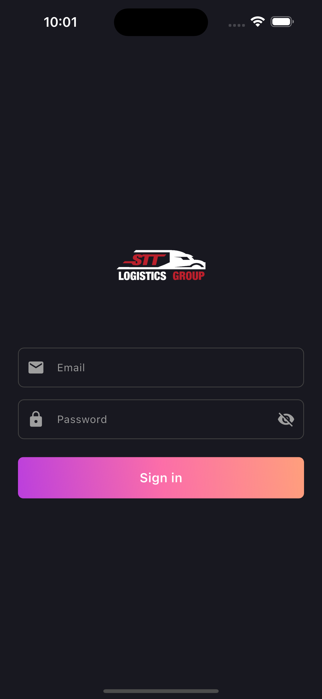
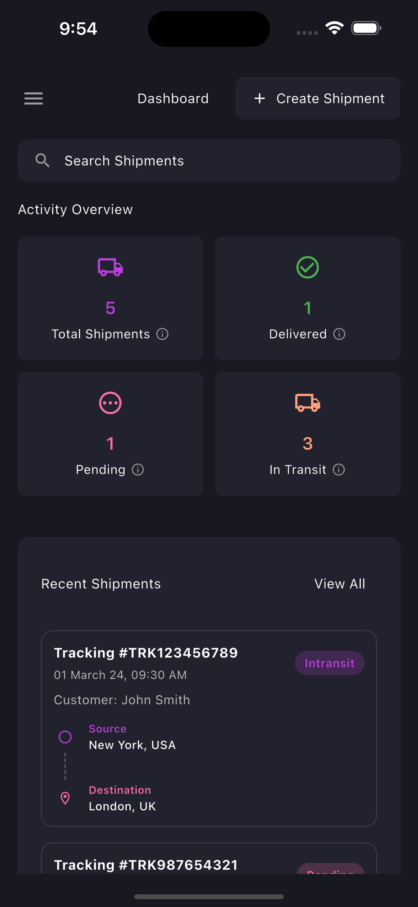
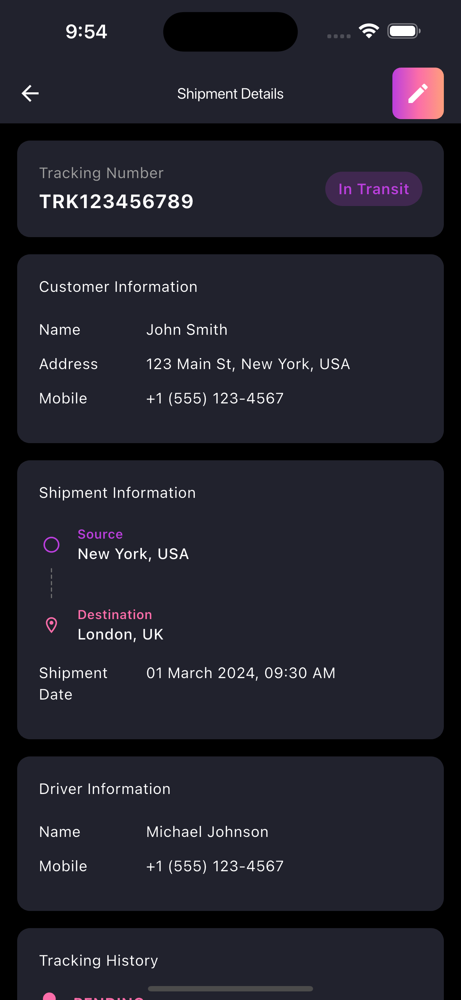
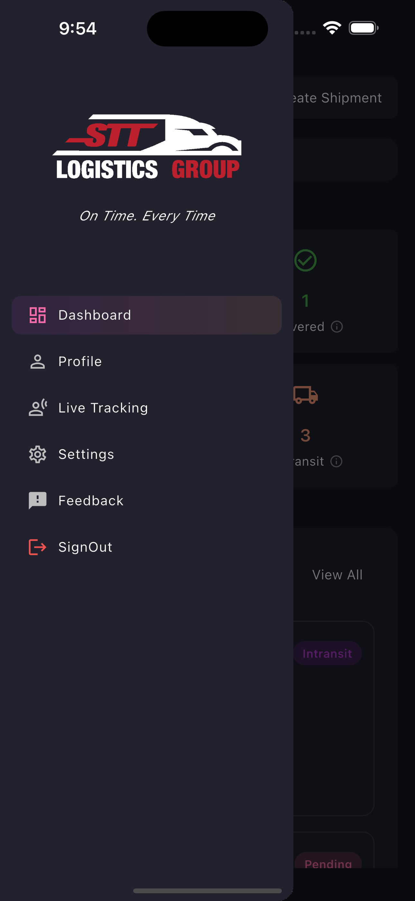

# 📦 Logistics Demo

A modern, feature-rich Flutter application for logistics and shipment tracking with a beautiful dark theme UI and comprehensive localization support. Built with Flutter, this application provides a seamless experience across mobile, web, and desktop platforms.


## 🌐 Live Demo

<div align="center">

### ✨ Experience the App Live ✨

🔗 **[Launch Logistics Demo Web App](https://logistics-demo-app-2024.web.app/)**

Try our fully functional web version with all features enabled!

</div>

## 📱 App Preview

### 💻 Web Application
<div style="display: flex; justify-content: center; margin-bottom: 20px;">
  <a href="https://logistics-demo-app-2024.web.app/" target="_blank">
    
  </a>
</div>

### 📸 Mobile Screenshots

<div style="display: flex; flex-wrap: wrap; gap: 10px; justify-content: center; margin-bottom: 20px;">
  
  
  
  
</div>

### 🎥 Demo Video

https://github.com/user-attachments/assets/5d4e5132-e067-4066-93d4-cd9059269f89

## ✨ Key Features

### 📱 Cross-Platform Support
- Responsive design that works seamlessly on Mobile, Web, and Desktop
- Platform-specific optimizations for the best user experience
- Dark theme support across all platforms

### 🌐 Comprehensive Localization
- Built-in support for multiple languages
- Easy-to-extend localization system
- All UI elements and messages are localized

### 📊 Dashboard & Analytics
- Real-time shipment status tracking
- Activity overview with key metrics
- Interactive charts and statistics
- Quick access to recent shipments

### 📝 Shipment Management
- Create, edit, and delete shipments
- Real-time status updates
- Detailed tracking history
- Customer information management
- Driver assignment system

### 🎯 Smart Features
- Advanced search functionality
- Status-based filtering
- Sorting and organization options
- Role-based access control

### 🎨 Modern UI Components
- Custom-designed widgets
- Smooth animations
- Intuitive navigation
- Responsive data tables
- Loading states and error handling

## 🛠 Technical Features

### Architecture
- Feature-first architecture for better scalability
- Clean separation of concerns
- Service-based business logic
- Reactive state management

### Code Quality
- Comprehensive error handling
- Type-safe implementation
- Well-documented codebase
- Consistent coding style

### Performance
- Optimized for smooth performance
- Efficient data loading
- Minimal app size
- Fast startup time

## 🚀 Getting Started

### Prerequisites
- Flutter SDK (latest version)
- Dart SDK (latest version)
- Android Studio / VS Code with Flutter extensions
- Git

### Installation

1. Clone the repository:
```bash
git clone https://github.com/vksep07/Logistics-App.git
cd logistics_demo
```

2. Install dependencies:
```bash
flutter pub get
```

3. Run the app:
```bash
flutter run
```

## 📁 Project Structure

```
lib/
├── constants/         # App constants and configurations
├── features/         # Feature-based modules
│   ├── auth/        # Authentication related screens and widgets
│   │   ├── screens/
│   │   └── widgets/
│   ├── dashboard/   # Dashboard related screens and widgets
│   │   ├── screens/
│   │   └── widgets/
│   └── shipment/    # Shipment management related screens and widgets
│       ├── screens/
│       └── widgets/
├── l10n/            # Localization files
├── services/        # Business logic and services
├── theme/           # Theme configuration
├── util/            # Utility functions
└── widgets/         # Reusable widgets
```

## 🌍 Localization

The app supports multiple languages through Flutter's built-in localization system.

### Adding a New Language
1. Create a new ARB file in `lib/l10n/`
2. Add translations for all strings
3. Run `flutter gen-l10n` to generate the localization code

### Supported Languages
- English (Default)
- More languages can be easily added

## 🤝 Contributing

We welcome contributions! Here's how you can help:

1. Fork the repository
2. Create your feature branch (`git checkout -b feature/AmazingFeature`)
3. Commit your changes (`git commit -m 'Add some AmazingFeature'`)
4. Push to the branch (`git push origin feature/AmazingFeature`)
5. Open a Pull Request

### Contribution Guidelines
- Write clear, descriptive commit messages
- Update documentation as needed
- Follow the existing code style
- Add comments for complex logic
- Test your changes thoroughly

## 📄 License

This project is licensed under the MIT License - see the [LICENSE](LICENSE) file for details.

## 📞 Support

If you have any questions or need help, please:
- Open an issue
- Contact the maintainers
- Check the documentation

## 🙏 Acknowledgments

- Flutter team for the amazing framework
- Contributors who have helped improve the project
- Open source community for various packages used in this project
